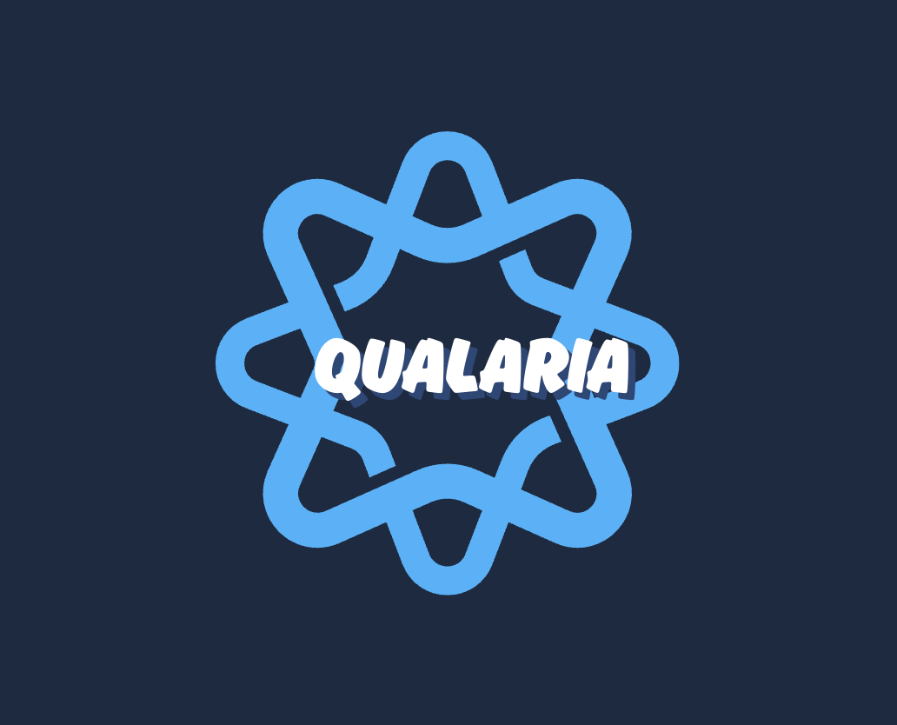

# Qualaria

Quantum Leap Against Malaria

> AIMS Quantum Computing Hackathon 2025

## Project Overview

Qualaria is a quantum computing-based solution to accelerate the discovery of new antimalarial drugs. It is a platform that allows researchers to quickly and efficiently predict most stable ligands for the PFEMP1 protein, which is a protein that is essential for the malaria parasite to survive.

## Project Structure

We download the PFEMP1 protein structure from the [AlphaFold](https://alphafold.ebi.ac.uk/) database.

### 1. Pockets Prediction

We use the [fpocket](https://github.com/Discngine/fpocket) package to predict the pockets of the PFEMP1 protein.

### 2. Ligands Prediction

We use the [Pocket2Mol](https://github.com/pengxingang/Pocket2Mol) package to predict the ligands for the pockets.

### 3. Ligands stability prediction

With [VQE](https://pubs.acs.org/doi/full/10.1021/acs.jctc.4c01657), we predict the stability of each ligand and select the 5 most stable ligands.

### 4. Ligands-Pockets binding stability

Then, we calculated the binding stability of the ligands to the pockets to select the most stable ligand.

## Resources

- [AlphaFold](https://alphafold.ebi.ac.uk/)
- [fpocket](https://github.com/Discngine/fpocket)
- [Pocket2Mol](https://github.com/pengxingang/Pocket2Mol)
- [Example Pocket2Mol](https://colab.research.google.com/drive/113NKjh6wBZhOYEy6VZwd03zD3cJffogL?usp=sharing)
- [VQE](https://pubs.acs.org/doi/full/10.1021/acs.jctc.4c01657)
- [Qiskit Nature](https://qiskit-community.github.io/qiskit-nature/tutorials/03_ground_state_solvers.html)

## License

[MIT](https://github.com/qualaria/qualaria/blob/main/LICENSE)

## Team Members

- [Astride Melvin Fokam Ninyim](https://github.com/MELAI-1)
- [Augustina Agyeman](https://github.com/Inna-pixel)
- [Dorcas Seshie](https://github.com/Lil-Seshie)
- [Ndam Abibou](https://github.com/abib-prime)
- [Prince Dorcis](https://github.com/prinx)

## Acknowledgments

Our mentors:

- [Eunice Gandote](https://github.com/eunicegit)
- [Chantelle Amoako-Atta](https://github.com/ChantelleAA)
- [Atadana Sogodam](https://github.com/el-dAna)

## Contacts

- [Astride Melvin Fokam Ninyim](https://www.linkedin.com/in/astridemelvinfokamninyim11/)
- [Augustina Agyeman](https://www.linkedin.com/in/augustina-agyeman-2b3189211/)
- [Dorcas Seshie](https://www.linkedin.com/in/dorcas-seshie-894799248/)
- [Abibou Ndam](https://www.linkedin.com/in/ndam-abibou-60755b238/)
- [Prince Dorcis](https://linkedin.com/in/princedorcis/)
- [Eunice Gandote](https://www.linkedin.com/in/eunice-gandote-459082108/)
- [Chantelle Amoako-Atta](https://www.linkedin.com/in/chantelleaa/)
- [Atadana Sogodam](https://www.linkedin.com/in/atadana-sogodam-0322a214b/)
